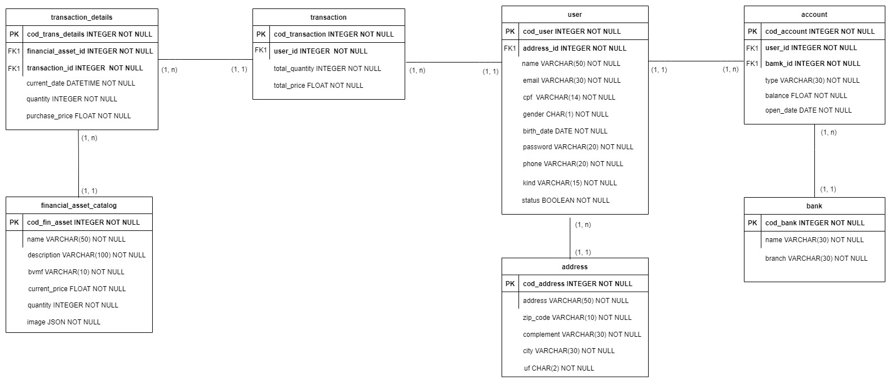
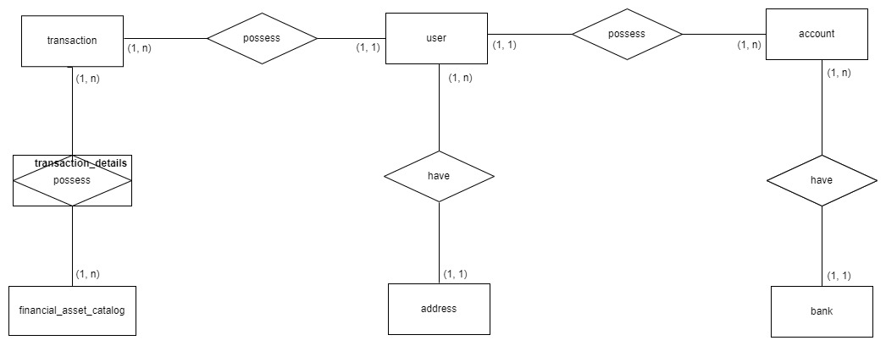
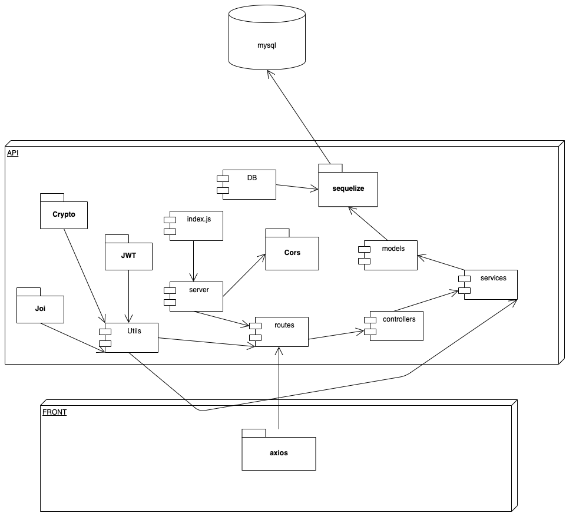
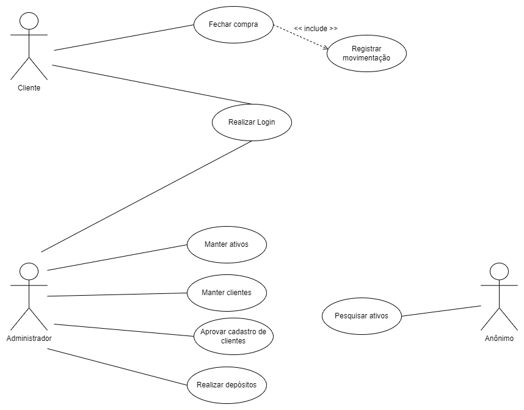

# **API RESTful Awesome Invest**
## **Introdução**
O Projeto AWESOME INVEST é um sistema de gestão financeira criado para fins de estudo. O Sistema tem o objetivo de listar os ativos e efetuar o gerenciamento destes, possibilitando a consulta e compra por parte do cliente. Além de garantir que o Administrador realize depósitos em contas de clientes e a consulta das transações realizadas.
A API foi desenvolvida utilizando o NodeJs, ExpressJs e o ORM Sequelize com Banco de dados MySql. A documentação foi feita utilizando o Swagger. O Jest e Supertest nos Testes Unitários e de Integração.
<br/>
<br/>
O Front-End foi desenvolvido utilizando o ReactJs. E está disponível para consulta no link abaixo:
```
git clone https://github.com/danielbarbozadasilva/financial-system-frontend
```
<br/>
<br/>

## **Escopo do produto**
O AWESOME INVEST é um Sistema web que tem o intuito de facilitar o cliente a começar a investir em ativos. Todas as suas funcionalidades foram pensadas e elaboradas para proporcionar facilidade e comodidade aos usuários da plataforma.

O Sistema tem como objetivo gerenciar os ativos cadastrados, disponibilizando ao cliente a opção de adquiri-los. O administrador do sistema possui o controle dos ativos cadastrados, assim como dos clientes, com a possibilidade de realizar depósitos em conta de clientes e obter informações de transações realizadas.

Os usuários do sistema são o Cliente e o Administrador. Todos possuem acesso ao sistema e a seu respectivo espaço. Além disso o Sistema conta com uma tela inicial que permite ao público navegar de modo simples entre os ativos, os ativos mais adquiridos e informações da plataforma.
<br/>
<br/>

## **Instalação com Docker**
Clone o repositório na pasta de sua preferência.
```
git clone https://github.com/danielbarbozadasilva/financial-system-backend.git
```

Abra a pasta do repositório clonado, e crie um arquivo ".env", exemplo:
```
DB_NAME = projeto
DB_USERNAME = root
DB_PASSWORD = Fh7Ed2am1
DB_HOST = localhost
DB_PORT = 3306
DB_DIALECT = mysql
DB_TIMEZONE = -03:00
PORT = 3011

MD5_SECRET=teste_secret_password
JWT_SECRET=dsfsfdsfdsdsdsfdsfs
JWT_VALID_TIME=9000000000

URL=http://localhost:3000
IMAGE_PATH=http://localhost:3011/static/
```

Abra a pasta do repositório clonado, e instale as dependências do projeto através do comando:
```
npm install
```

Logo após o término da instalação. Instale o Docker e o docker compose através do link: 
```
https://docs.docker.com/desktop/windows/install/
```
Com o Docker instalado, abra o terminal na pasta do projeto e execute o seguinte comando:
```
docker-compose up
``` 

Logo após, vamos criar e popular as tabelas do banco de dados através dos comandos:
```
npm run add-migrations
npm run add-seeders
```

Execute o comando para rodar o projeto:
```
npm run dev
```

Para executar os teste de integração e unitário:
```
npm run test-create-db
npm run test-add-migrations
npm run test-add-seeders
```

Execute o comando para rodar os testes de integração:
```
npm run test:integration
```

Execute o comando para rodar os testes unitários:
```
npm run test:unit
```

Com o projeto rodando, abra a documentação do Swagger:
```
http://localhost:3011/api-docs/
```

Com o projeto rodando, abra a documentação do Postman na pasta do projeto:
```
docs -> PROJETO-INVESTIMENTOS.postman_collection.json
```
<br/>
<br/>

## **Modelo lógico de dados**
<br/>

<br/>
<br/>
<br/>
<br/>

## **Modelo conceitual de dados**
<br/>

<br/>
<br/>
<br/>
<br/>

## **Diagrama de componentes**
<br/>

<br/>
<br/>
<br/>
<br/>

## **Requisitos funcionais**
<br/>

RF001 – O sistema deve controlar a autenticação dos usuários.

RF002 – O sistema deve manter cadastro de clientes.

RF003 – O sistema deve manter ativos.

RF004 – O sistema deve controlar a venda de ativos.

RF005 – O sistema deve manter clientes.

RF006 – O sistema deve aprovar ou bloquear o acesso do cliente.

RF007 – O sistema deve listar as transações efetuadas.

RF008 – O sistema deve realizar depósitos.

RF009 – O sistema deve listar os depósitos efetuadas.

RF010 – O sistema deve listar os dados bancários do cliente.

<br/>
<br/>

## **Requisitos não funcionais**
<br/>

| Identificação | Classificação | Descrição |
| --- | --- | --- |
|RNF001   |Implementação     |O back-end do sistema deve ser desenvolvido em NodeJs e ExpressJs.    |
|RNF002   |Implementação     | O front-end do sistema deve ser desenvolvido em ReactJs.    |
|RNF003   |Implementação     |O banco de dados a ser utilizado é o MySql.     |
|RNF004   |Implementação     | O sistema deve funcionar em Sistemas Operacionais Windows, Mac e Linux.    |
|  |  |  |

<br/>
<br/>

## **Regras de negócio**
<br/>

| Identificação | Classificação | Descrição |
| --- | --- | --- |
|RN001   |Controle de acesso     |Os acessos permitidos ao sistema serão: Administrador e Cliente. O usuário anônimo terá acesso apenas ao portal do site.    |
|RN002   |Aplicar imposto     | Em todas as vendas de ativos serão acrescidos 5% (cinco por cento) referente a impostos.    |
|RN003   |Controle de veracidade     |Apenas clientes autorizados pelo administrador poderão ter acesso ao sistema.     |
|RN004   |Limite de ação     | Apenas o Administrador poderá incluir, editar e excluir ativos no sistema.    |
|RN005   |Limite de ação     | Apenas o Administrador poderá editar os dados do cliente.     |
|RN006   |Limite de ação     | O Cliente poderá visualizar apenas os dados da sua conta. Tais como: patrimônio, histórico de transações e depósitos.     |
|RN007   |Limite de ação     | Apenas o Administrador poderá visualizar informações de todos os clientes, suas respectivas contas, patrimônio e transações efetuadas.    |
|  |  |  |

<br/>
<br/>

## **Lista de atores e casos de uso**
<br/>

## Lista de atores que interagem com o sistema:
* Administrador
* Cliente
* Anônimo
<br/>
<br/>

## Lista de Casos de Uso:
<br/>

1 - Fechar compra

2 - Registrar movimentação

3 - Realizar Login

4 - Manter ativos

5 - Manter clientes

6 - Aprovar cadastro de clientes

7 - Realizar depósitos

8 - Pesquisar ativos

<br/>
<br/>

## **Diagrama de Casos de uso**
<br/>

<br/>
<br/>
<br/>
<br/>

> ## Licença
- Licença GPLv3
<br/>
<br/>

> ## Metodologias e Padrões
* RESTful
* Conventional commits
* GitFlow
* Error handler

<br/>
<br/>

> ## Bibliotecas e Ferramentas
* Jest
* Swagger
* Docker
* Sequelize
* MySql
* Formidable
* Md5
* Uuid
* Path
* Joi
* Http-status
* Nodemon
* Git
* JsonWebToken
* Express
* Eslint
* Prettier
* FileSystem