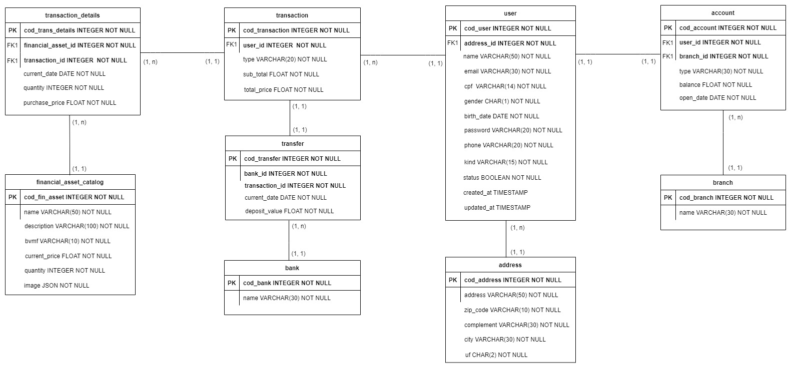
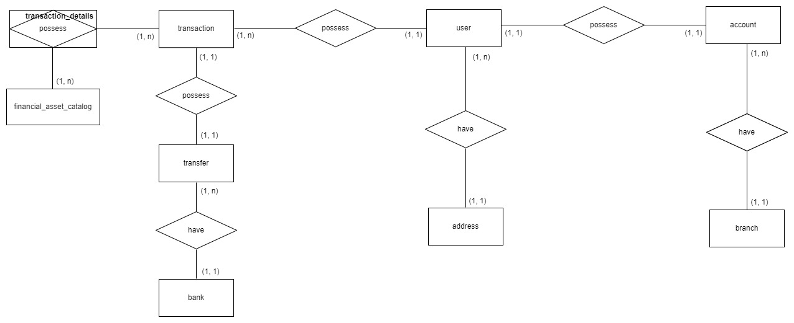

# **API Awesome Invest**
O Projeto AWESOME INVEST é um sistema de gestão financeira criado para fins de estudo. O Sistema tem o objetivo de listar os ativos e efetuar o gerenciamento destes, possibilitando a consulta e compra por parte dos clientes. Além de garantir que o Administrador realize depósitos em conta de clientes e a consulta das transações realizadas.
A API foi desenvolvida utilizando o NodeJs, ExpressJs e o ORM Sequelize com Banco de dados MySql.
<br/>
<br/>

O Front-End foi desenvolvido utilizando o ReactJs. E está disponível para consulta no link abaixo:
```
https://github.com/danielbarbozadasilva/financial-system-frontend
```
<br/>
<br/>

## **Escopo do produto**
O AWESOME INVEST é um Sistema web que vem com o intuito de facilitar ao cliente investir em ativos. Todas as suas funcionalidades foram pensadas e elaboradas para proporcionar facilidade e comodidade aos usuários da plataforma.

O Sistema tem como objetivo gerenciar os ativos cadastrados, disponibilizando ao cliente a opção de adquiri-los. O administrador do sistema possui o controle dos ativos cadastrados, assim como dos clientes, com a possibilidade de realizar depósitos em conta de clientes e obter informações de transações realizadas.

Os usuários do sistema são os Clientes e o Administrador. Todos possuem acesso ao sistema e a seu respectivo espaço. Além disso o Sistema conta com uma tela inicial que permite ao público navegar de modo simples entre os ativos, os ativos mais adquiridos e informações da plataforma.

<br/>
<br/>

## **Instalação com Docker**
Clone o repositório na pasta de sua preferência.
```
https://github.com/danielbarbozadasilva/financial-system-backend.git
```

Abra a pasta do repositório clonado, e crie um arquivo ".env", exemplo:
```
DB_NAME = projeto
DB_USERNAME = root
DB_PASSWORD = Fh7Ed2am1
DB_HOST = localhost
DB_PORT = 3306
DB_DIALECT = mysql
DB_TIMEZONE = -03:00
PORT = 3011

MD5_SECRET=teste_secret_password
JWT_SECRET=dsfsfdsfdsdsdsfdsfs
JWT_VALID_TIME=999999999999999999

URL=http://localhost:3000
IMAGE_PATH=http://localhost:3011/static/
```

Abra a pasta do repositório clonado, e instale as dependências do projeto através do comando:
```
npm install
```

Logo após o término da instalação. Instale o Docker e o docker compose através do link: 
```
https://docs.docker.com/desktop/windows/install/
```
Com o Docker instalado, execute o seguinte comando:
```
docker-compose up
``` 

Logo após, vamos criar e popular as tabelas do banco de dados através dos comandos:
```
npm run add-migrations
npm run add-seeders
```

Execute o comando para rodar o projeto:
```
npm run dev
```

Com o projeto rodando, abra a documentação do Swagger:
```
http://localhost:3011/api-docs/
```

Com o projeto rodando, abra a documentação do Postman na pasta do projeto:
```
docs -> PROJETO-INVESTIMENTOS.postman_collection.json
```
<br/>


## **Modelo lógico de dados**
<br/>

<br/>
<br/>

## **Diagrama de componentes**
<br/>

<br/>
<br/>

## **Modelo conceitual de dados**
<br/>

<br/>
<br/>

## **Requisitos funcionais**
<br/>

[RF01] É necessário lidar com a autenticação do usuário administrador. Explicação: O Sistema deve permitir o acesso do administrador com base em suas credenciais. Bloqueando qualquer tentativa de acesso por outros tipos de usuários.

[RF02] É necessário lidar com a autenticação do usuário cliente. Explicação: O Sistema deve permitir o acesso aos clientes com base em suas credenciais. Bloqueando qualquer tentativa de acesso por outros usuários.

[RF03] O Sistema deve manter ativos. Explicação: O Sistema permitirá que o usuário administrador consulte ativos, cadastre novos ativos, edite os dados do ativo e exclua um ativo.

[RF04] O usuário cliente deve se cadastrar. Explicação: O Sistema permitirá o cadastro do cliente.

[RF05] O usuário administrador deve autorizar o acesso do cliente ao sistema. Explicação: O administrador pode autorizar ou não o acesso de clientes ao sistema.

[RF06] O usuário administrador deve conseguir visualizar os dados do cliente no sistema. Explicação: O administrador pode consultar os dados do cliente no sistema.

[RF07] O usuário administrador deve conseguir atualizar os dados do cliente no sistema. Explicação: O administrador pode atualizar os dados do cliente no sistema.

[RF08] O usuário administrador deve conseguir visualizar todas as transações realizados pelos clientes. Explicação: O Sistema permite que o administrador visualize as transações realizados pelo cliente.

[RF09] O usuário cliente deve poder visualizar as transações que realizou. Explicação: O Sistema permite que o cliente visualize as suas transações.

[RF10] O cliente deve visualizar os seus dados bancários. Explicação: O Sistema deve exibir o saldo em conta e seu respectivo patrimônio.

[RF11] O usuário administrador deve poder efetuar depósitos na conta do cliente. Explicação: O Sistema deve permitir ao administrador depositar um determinado valor na conta do cliente.

[RF12] O Sistema deve exibir uma barra de pesquisa para facilitar a busca por contas. Explicação: Ao consultar os dados da conta do cliente o usuário administrador deve poder filtrar as informações do cliente.

<br/>
<br/>

> ## Licença
- Licença GPLv3
<br/>
<br/>

> ## Metodologias e Padrões
* MVC
* Conventional commits
* GitFlow
* Casos de uso
<br/>
<br/>

> ## Bibliotecas e Ferramentas
* Swagger
* Sequelize
* Docker
* NPM
* Git
* JsonWebToken
* Express
